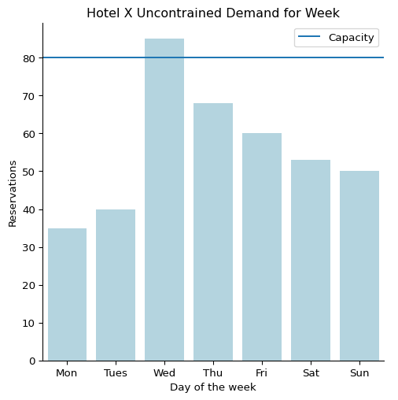
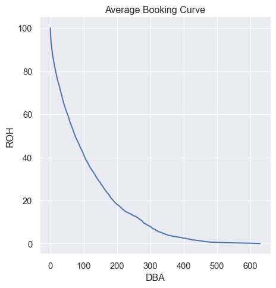
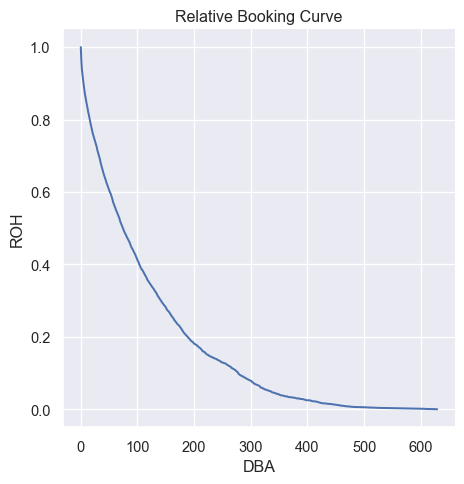
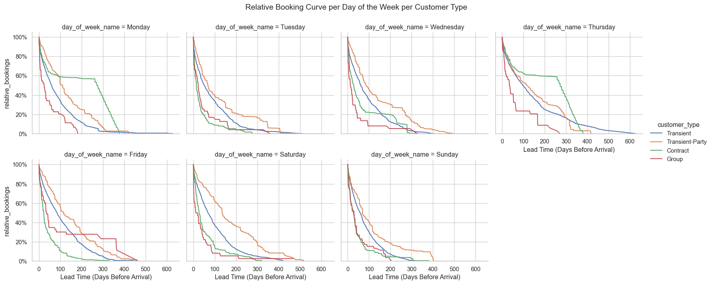
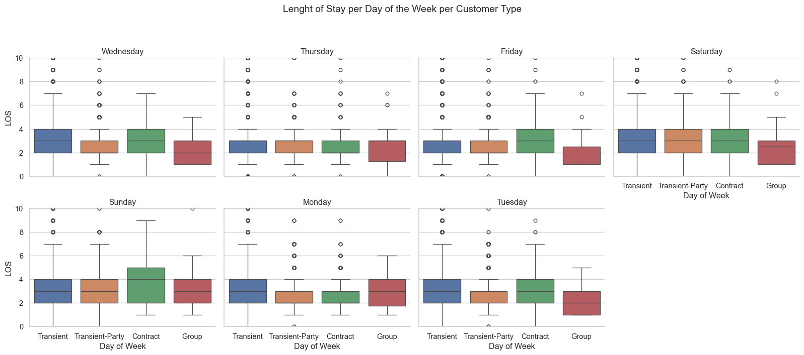
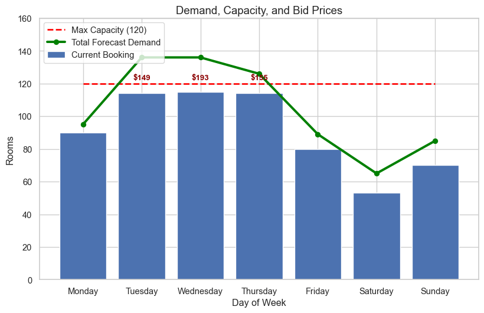

# Hotel Bid Price Calculation
Luis Martinez

# Introduction

In hotel revenue management we encounter the MOST fundamental question
for optimization, and that is network revenue management.

To explain what network revenue management is, first we need to
understand what the fundamental question of revenue management actually
is.

# Review of Littlewood’s

Imagine you are a front desk agent at a hotel and you have one room for
Friday. You check the system and that night has two rates, one at \$100
and another one discounted at \$50.

So far so good…

However, one customer arrives and tells you he wants to purchase that
night for \$50, now you face a fundamental question of revene
management, should you sell it for \$50 or wait for a customer that pays
\$100.

There is a probability involved with this customer and an expected value
of that payoff, check \[this link\] for more information about the math,
I go into detail of how it works.

# A question more complicated

Now hotels do not only manage 1 rate but multiple, at least 30 at a time
for multiple nights, but let’s imagine how would this look like in a
hotel manager dashboard.

``` python
days = ['Mon', 'Tues', 'Wed', 'Thu', 'Fri', 'Sat', 'Sun']
reservations = [35, 40, 85, 68, 60, 53, 50]

plt.figure(figsize=(10,10))
sns.catplot(x = days, y = reservations, kind="bar", color='lightblue')
plt.axhline(y = 80, label = 'Capacity')
plt.title("Hotel X Uncontrained Demand for Week")
plt.xlabel("Day of the week")
plt.ylabel("Reservations")
plt.legend()
plt.show()
```

    <Figure size 960x960 with 0 Axes>



Let’s imagine that we have this dahsboard in our computers, we can
clearly see that the demand for Wednesday is higher than for all the
other days. Let’s again suppose that we have the rate \$100 and \$50,
well a very naive method to do it is to restrain the availability for
the discounted rate of \$50 for Wendnesday.

However, this strategy has a great flaw, that is Lenght of Stay (LOS)
imagine that you have one customer that pays \$50 for Monday, Tuesday,
Wednesday and Thursday, well that revenue \$200 will exceed the higher
paying customer that pays only to stay on the Wednesday!

This is the relationship between dilution and spoilage, you can check
more about all the math relationship in this link \[\].

The way that revenue managers usually solve this problem is by using
capacity controls as Minimum Lenght of Stay, but this is extremely
subjective and for customers in the web side of reservations, well they
see XX on the days that have high demand, thinking that they are all
sold.

But there is a way to control this for any number of rates and give a
numerical threshold for each date, that is the beauty of Bid Prices!

# Bid Prices

Bid prices are the minimum amount a hotel can accept for a given night,
not how it should be priced, but the cost of opportunity of selling that
room now and not waiting.

## Forecasting and LOS

For this worked example we will use a hotel data base, that looks a lot
like a hotel reservation system, let’s check it out.

*Importing some libraries for structured data*

For this project we will use the polars package since I already have
worked with this data and I do not want to query all of that data to my
RAM and it is way faster than Pandas (also I am learning it so it is
good practice).

First we create a base query where our data wrangled for all, this is
helpfull to have fast selections.

``` python
import polars as pl
import pandas as pd
def apply_base_query(lazyframe: pl.LazyFrame) -> pl.LazyFrame:
    cols_to_drop = ['arrival_date_year', 'arrival_date_month', 'arrival_date_week_number', 'arrival_date_day_of_month', 'children', 'babies', 'meal', 'country', 'is_repeated_guest', 'previous_cancellations', 'previous_bookings_not_canceled', 'reserved_room_type', 'assigned_room_type', 'booking_changes', 'deposit_type', 'agent', 'company', 'days_in_waiting_list', 'required_car_parking_spaces', 'total_of_special_requests', 'reservation_status', 'reservation_status_date', 'date_string']

    return (
        lazyframe
        .filter(pl.col("hotel") == "City Hotel")
        .with_columns(
            pl.col("Date")
            .str.to_date(format="%Y-%m-%d")
            .dt.strftime("%A")
            .alias("day_of_week")
        )
        .drop(cols_to_drop)
    )
```

``` python
lf = pl.scan_csv("C:/Users/luism/Coding/hotel_data.csv")
lf_filtered = apply_base_query(lf)
lf_filtered.collect()
```

<div><style>
.dataframe > thead > tr,
.dataframe > tbody > tr {
  text-align: right;
  white-space: pre-wrap;
}
</style>
<small>shape: (79_330, 12)</small>

| hotel | is_canceled | lead_time | stays_in_weekend_nights | stays_in_week_nights | adults | market_segment | distribution_channel | customer_type | adr | Date | day_of_week |
|----|----|----|----|----|----|----|----|----|----|----|----|
| str | i64 | i64 | i64 | i64 | i64 | str | str | str | f64 | str | str |
| "City Hotel" | 0 | 6 | 0 | 2 | 1 | "Offline TA/TO" | "TA/TO" | "Transient" | 0.0 | "2015-07-01" | "Wednesday" |
| "City Hotel" | 1 | 88 | 0 | 4 | 2 | "Online TA" | "TA/TO" | "Transient" | 76.5 | "2015-07-01" | "Wednesday" |
| "City Hotel" | 1 | 65 | 0 | 4 | 1 | "Online TA" | "TA/TO" | "Transient" | 68.0 | "2015-07-01" | "Wednesday" |
| "City Hotel" | 1 | 92 | 2 | 4 | 2 | "Online TA" | "TA/TO" | "Transient" | 76.5 | "2015-07-01" | "Wednesday" |
| "City Hotel" | 1 | 100 | 0 | 2 | 2 | "Online TA" | "TA/TO" | "Transient" | 76.5 | "2015-07-02" | "Thursday" |
| … | … | … | … | … | … | … | … | … | … | … | … |
| "City Hotel" | 0 | 23 | 2 | 5 | 2 | "Offline TA/TO" | "TA/TO" | "Transient" | 96.14 | "2017-08-30" | "Wednesday" |
| "City Hotel" | 0 | 102 | 2 | 5 | 3 | "Online TA" | "TA/TO" | "Transient" | 225.43 | "2017-08-31" | "Thursday" |
| "City Hotel" | 0 | 34 | 2 | 5 | 2 | "Online TA" | "TA/TO" | "Transient" | 157.71 | "2017-08-31" | "Thursday" |
| "City Hotel" | 0 | 109 | 2 | 5 | 2 | "Online TA" | "TA/TO" | "Transient" | 104.4 | "2017-08-31" | "Thursday" |
| "City Hotel" | 0 | 205 | 2 | 7 | 2 | "Online TA" | "TA/TO" | "Transient" | 151.2 | "2017-08-29" | "Tuesday" |

</div>

Now that we have our data we can start viewing how the data looks like.

As you can see they are “entry” like data from a reservation system,
people reserve and it pops up in this data set, some of them cancel and
some of them actually do not cancel.

One of the most important columns in the data is the lead time and the
customer type, we can think of these as our “rates” since most of them
are rate classes. We also have the stays in week and stays in weekends.

For example let’s take a look at how the rates differ from customer
type.

``` python
rates_query = (
    lf_filtered
    .group_by("customer_type")
    .agg(pl.col('adr').mean().round(2))
    .collect()
)
rates_query
```

<div><style>
.dataframe > thead > tr,
.dataframe > tbody > tr {
  text-align: right;
  white-space: pre-wrap;
}
</style>
<small>shape: (4, 2)</small>

| customer_type     | adr    |
|-------------------|--------|
| str               | f64    |
| "Group"           | 91.95  |
| "Transient-Party" | 90.87  |
| "Transient"       | 110.02 |
| "Contract"        | 94.05  |

</div>

As wer can see we have 4 different types of rate groups and we can
obviously see that Transient is the most desirable customer, since it’s
rate is the higest, however it is probably the one with the less demand,
since Transient-Party, also known asd groups, are filled for bulk
reservations, the key is to find the perfect balance between both.

Now let’s answer another question, we can see that customers reserve in
different lead times, that is days before arrival, that is known as the
booking curve, let’s see how that looks like.

``` python
long_data = (
    lf_filtered
    .group_by("Date", "lead_time")
    .agg(pl.len().alias("reservations"))
    .sort("Date", "lead_time")
    )
df = long_data.collect()
```

``` python
#helper function 
def order_pivot_columns(df: pl.DataFrame, index_col: str) -> pl.DataFrame:
    all_cols = df.columns
    lead_time_cols_int = []
    for col in all_cols:
        if col != index_col:
            lead_time_cols_int.append(int(col))
    lead_time_cols_int.sort()
    sorted_lead_time_str = [str(col) for col in lead_time_cols_int]
    final_order = [index_col] + sorted_lead_time_str
    return df.select(final_order)
```

``` python
booking_curve_query = (
    df
    .pivot(
        index = 'Date',
        columns = 'lead_time',
        values= 'reservations',
        aggregate_function= 'first'
    )
)

booking_curve_pl = order_pivot_columns(booking_curve_query, index_col="Date")
df_pd = booking_curve_pl.to_pandas()

df_pd.index = df_pd['Date']
df_pd.drop('Date', axis = 1, inplace=True)
```

``` python
df_pd = df_pd.fillna(0)
booking_curve = df_pd.iloc[:, ::-1].cumsum(axis = 1).iloc[:, ::-1]

booking_curve
```

<div>
<style scoped>
    .dataframe tbody tr th:only-of-type {
        vertical-align: middle;
    }
&#10;    .dataframe tbody tr th {
        vertical-align: top;
    }
&#10;    .dataframe thead th {
        text-align: right;
    }
</style>

|  | 0 | 1 | 2 | 3 | 4 | 5 | 6 | 7 | 8 | 9 | ... | 580 | 587 | 594 | 601 | 605 | 608 | 615 | 622 | 626 | 629 |
|----|----|----|----|----|----|----|----|----|----|----|----|----|----|----|----|----|----|----|----|----|----|
| Date |  |  |  |  |  |  |  |  |  |  |  |  |  |  |  |  |  |  |  |  |  |
| 2015-07-01 | 79.0 | 79.0 | 79.0 | 79.0 | 79.0 | 79.0 | 79.0 | 78.0 | 78.0 | 78.0 | ... | 0.0 | 0.0 | 0.0 | 0.0 | 0.0 | 0.0 | 0.0 | 0.0 | 0.0 | 0.0 |
| 2015-07-02 | 49.0 | 49.0 | 49.0 | 49.0 | 48.0 | 48.0 | 48.0 | 48.0 | 48.0 | 48.0 | ... | 0.0 | 0.0 | 0.0 | 0.0 | 0.0 | 0.0 | 0.0 | 0.0 | 0.0 | 0.0 |
| 2015-07-03 | 16.0 | 16.0 | 16.0 | 16.0 | 16.0 | 15.0 | 15.0 | 15.0 | 15.0 | 15.0 | ... | 0.0 | 0.0 | 0.0 | 0.0 | 0.0 | 0.0 | 0.0 | 0.0 | 0.0 | 0.0 |
| 2015-07-04 | 38.0 | 38.0 | 38.0 | 38.0 | 38.0 | 38.0 | 38.0 | 38.0 | 38.0 | 38.0 | ... | 0.0 | 0.0 | 0.0 | 0.0 | 0.0 | 0.0 | 0.0 | 0.0 | 0.0 | 0.0 |
| 2015-07-05 | 8.0 | 8.0 | 8.0 | 8.0 | 8.0 | 8.0 | 8.0 | 8.0 | 8.0 | 8.0 | ... | 0.0 | 0.0 | 0.0 | 0.0 | 0.0 | 0.0 | 0.0 | 0.0 | 0.0 | 0.0 |
| ... | ... | ... | ... | ... | ... | ... | ... | ... | ... | ... | ... | ... | ... | ... | ... | ... | ... | ... | ... | ... | ... |
| 2017-08-27 | 107.0 | 100.0 | 93.0 | 93.0 | 92.0 | 92.0 | 92.0 | 90.0 | 90.0 | 90.0 | ... | 0.0 | 0.0 | 0.0 | 0.0 | 0.0 | 0.0 | 0.0 | 0.0 | 0.0 | 0.0 |
| 2017-08-28 | 133.0 | 130.0 | 130.0 | 130.0 | 129.0 | 127.0 | 127.0 | 126.0 | 125.0 | 125.0 | ... | 0.0 | 0.0 | 0.0 | 0.0 | 0.0 | 0.0 | 0.0 | 0.0 | 0.0 | 0.0 |
| 2017-08-29 | 90.0 | 84.0 | 82.0 | 82.0 | 82.0 | 82.0 | 80.0 | 79.0 | 79.0 | 79.0 | ... | 0.0 | 0.0 | 0.0 | 0.0 | 0.0 | 0.0 | 0.0 | 0.0 | 0.0 | 0.0 |
| 2017-08-30 | 47.0 | 46.0 | 46.0 | 46.0 | 46.0 | 45.0 | 45.0 | 45.0 | 44.0 | 43.0 | ... | 0.0 | 0.0 | 0.0 | 0.0 | 0.0 | 0.0 | 0.0 | 0.0 | 0.0 | 0.0 |
| 2017-08-31 | 79.0 | 79.0 | 78.0 | 77.0 | 74.0 | 73.0 | 73.0 | 73.0 | 73.0 | 72.0 | ... | 0.0 | 0.0 | 0.0 | 0.0 | 0.0 | 0.0 | 0.0 | 0.0 | 0.0 | 0.0 |

<p>793 rows × 453 columns</p>
</div>

We can now vizualize this data to see how the booking curve looks like,
let’s see from all of our data what is the mean number of reservations
on hand for a given DBA.

``` python
cols = booking_curve.columns.to_list()
cols_int = [int(x) for x in cols]
mean_for_dba = [booking_curve[x].mean() for x in cols]

plot_data = pd.DataFrame({
    'DBA': cols_int,
    "ROH": mean_for_dba
})
```

``` python
sns.set_theme()
sns.relplot(data = plot_data, x = 'DBA', y = 'ROH', kind = 'line')
plt.title("Average Booking Curve")
plt.xlabel("DBA")
plt.ylabel("ROH")
plt.show()
```



Now this information is useful to see what percentage of the total
reservations we have until certain point before the arrival or DBA.

But here we have some absolute values, but we can create another table
to check the relative booking curve, this can help us to understand what
percent of the reservations we had for each DBA.

``` python
relative_roh = [x / mean_for_dba[0] for x in mean_for_dba]
plot_data['relative'] = relative_roh
sns.set_theme()
sns.relplot(data = plot_data, x = 'DBA', y = 'relative', kind = 'line')
plt.title("Relative Booking Curve")
plt.xlabel("DBA")
plt.ylabel("ROH")
plt.show()
```



Another question that we have to ask ourselves is how would this vary
from rate class to rate class.

Let’s check it out lets create some subplots of how the booking curve
changes as the day of the week changes and the customer type is
different.

``` python
data = lf_filtered.collect()

df = data.to_pandas()
```

``` python
def get_booking_curve(df_input: pd.DataFrame, fare: str) -> pd.DataFrame:
    
    df_input['Date'] = pd.to_datetime(df_input['Date'], format="%Y-%m-%d")

    df_filtered = df_input[df_input['customer_type'] == fare].copy()
    df_filtered['day_of_week_num'] = df_filtered['Date'].dt.weekday


    grouped = df_filtered.groupby(['day_of_week_num', 'lead_time']).size().reset_index()

    grouped.rename(columns={0: 'reservations'}, inplace=True)

    pivoted = grouped.pivot_table(
        index='day_of_week_num',
        columns= 'lead_time',
        values= 'reservations'
    )

    pivoted_filled = pivoted.fillna(0)

    pivoted_cum_sum = pivoted_filled.iloc[:, ::-1].cumsum(axis=1).iloc[:, ::-1]

    total = pivoted_cum_sum.iloc[:,0]

    relative_booking_curve = pivoted_cum_sum.div(total, axis=0)


    relative_booking_curve_long = relative_booking_curve.reset_index().melt(
        id_vars='day_of_week_num',
        var_name='lead_time',
        value_name='relative_bookings'
    )
    relative_booking_curve_long['lead_time'] = relative_booking_curve_long['lead_time'].astype(int)

    return relative_booking_curve_long
```

``` python
transient = get_booking_curve(df, "Transient")
transient_party = get_booking_curve(df, 'Transient-Party')
contract = get_booking_curve(df, 'Contract')
group = get_booking_curve(df, 'Group')

transient['customer_type'] = 'Transient'
transient_party['customer_type'] = 'Transient-Party'
contract['customer_type'] = 'Contract'
group['customer_type'] = 'Group'

all_curves = pd.concat([transient, transient_party, contract, group], ignore_index=True)

day_names = {0: 'Monday', 1: 'Tuesday', 2: 'Wednesday', 3: 'Thursday', 4: 'Friday', 5: 'Saturday', 6: 'Sunday'}
all_curves['day_of_week_name'] = all_curves['day_of_week_num'].map(day_names)
```

``` python
sns.set_theme(style = 'whitegrid')

g = sns.relplot(
    data = all_curves,
    x = 'lead_time',
    y = 'relative_bookings',
    col = 'day_of_week_name',
    hue = 'customer_type',
    kind = 'line',
    col_wrap=4,
    height=3.5,
    aspect=1.2
)
g.fig.suptitle("Relative Booking Curve per Day of the Week per Customer Type", y = 1.05)

for ax in g.axes.flat:
    ax.yaxis.set_major_formatter(plt.FuncFormatter(lambda y, _: f'{y:.0%}'))
    ax.set_ylim(0, 1.05)
    ax.set_xlabel('Lead Time (Days Before Arrival)')

plt.show()
```



We can clearly see that one of the main assumptions that demand for
lower fares happen before high paying fares is right, since for example
group’s booking curve starts building up before the transient booking
curve.

Now we can also view how the lenght of stay patterns happen between our
fare classes to understand how these fares also vary on their LOS, since
we think that LOS for lower fares is greater than for high paying
customers.

To simplify, we will add both length of stay and construcut these
boxplots

``` python
los = df[['stays_in_weekend_nights', 'stays_in_week_nights', 'customer_type', 'day_of_week']].copy()
los['LOS'] = los['stays_in_weekend_nights'] + los['stays_in_week_nights']
los.drop(['stays_in_weekend_nights', 'stays_in_week_nights'], axis=1, inplace = True)
```

``` python
g_2 = sns.catplot(
    data = los,
    x = 'customer_type',
    y = 'LOS',
    col = 'day_of_week',
    hue = 'customer_type',
    kind = 'box',
    col_wrap= 4,
    height= 3.5,
    aspect=1.2
)

g_2.fig.suptitle("Lenght of Stay per Day of the Week per Customer Type", y = 1.05)

for ax in g_2.axes.flat:
    ax.set_xlabel('Day of Week')
    ax.set_ylim(0, 10)
    ax.set_ylabel("LOS")
g_2.set_titles(col_template="{col_name}")
plt.tight_layout()
plt.show()
```



## Bid Pricing Calculation

Now we are going to run a BID price simulation to see how this works,
for this we will take one week worth of data so that we can understand
what is happening in this math calculation.

Let’s suppose that this hotel has 120 rooms (just for the simulation, it
is not actually stated). We are going to use our relative booking curves
and our LOS to create a deterministic demand.

In our hotel dashboard we see something like this.

``` python
hotel_dash = pd.DataFrame({
    'Day_of_Week': ['Monday', 'Tuesday', 'Wednesday', 'Thursday', 'Friday', 'Saturday', 'Sunday'],
    'Transient': [30, 35, 40, 34, 30, 20, 25],
    'Transient-Party': [25, 30, 30, 30, 25, 15, 20],
    'Group': [20, 25, 25, 25, 15, 10, 15],
    'Contract': [15, 24, 20, 25, 10, 8, 10],
    'Total': [90, 114, 115, 114, 80, 53, 70],
    'Total_Rooms': [120, 120, 120, 120, 120, 120, 120],
    'DBA': [1,2,3,4,5,6,7]
})
hotel_dash
```

<div>
<style scoped>
    .dataframe tbody tr th:only-of-type {
        vertical-align: middle;
    }
&#10;    .dataframe tbody tr th {
        vertical-align: top;
    }
&#10;    .dataframe thead th {
        text-align: right;
    }
</style>

|     | Day_of_Week | Transient | Transient-Party | Group | Contract | Total | Total_Rooms | DBA |
|-----|-------------|-----------|-----------------|-------|----------|-------|-------------|-----|
| 0   | Monday      | 30        | 25              | 20    | 15       | 90    | 120         | 1   |
| 1   | Tuesday     | 35        | 30              | 25    | 24       | 114   | 120         | 2   |
| 2   | Wednesday   | 40        | 30              | 25    | 20       | 115   | 120         | 3   |
| 3   | Thursday    | 34        | 30              | 25    | 25       | 114   | 120         | 4   |
| 4   | Friday      | 30        | 25              | 15    | 10       | 80    | 120         | 5   |
| 5   | Saturday    | 20        | 15              | 10    | 8        | 53    | 120         | 6   |
| 6   | Sunday      | 25        | 20              | 15    | 10       | 70    | 120         | 7   |

</div>

We can also simulate some rates for the hotel, with dynamic pricing.

``` python
hotel_rates = pd.DataFrame({
    'Day_of_Week': ['Monday', 'Tuesday', 'Wednesday', 'Thursday', 'Friday', 'Saturday', 'Sunday'],
    'Transient': [181.0, 204.0, 222.0, 207.0, 169.0, 148.0, 164.0],
    'Transient-Party': [158.0, 175.0, 193.0, 184.0, 146.0, 134.0, 144.0],
    'Group': [131.0, 149.0, 166.0, 155.0, 129.0, 114.0, 121.0],
    'Contract': [127.0, 136.0, 148.0, 146.0, 123.0, 100.0, 115.0]
})
hotel_rates
```

<div>
<style scoped>
    .dataframe tbody tr th:only-of-type {
        vertical-align: middle;
    }
&#10;    .dataframe tbody tr th {
        vertical-align: top;
    }
&#10;    .dataframe thead th {
        text-align: right;
    }
</style>

|     | Day_of_Week | Transient | Transient-Party | Group | Contract |
|-----|-------------|-----------|-----------------|-------|----------|
| 0   | Monday      | 181.0     | 158.0           | 131.0 | 127.0    |
| 1   | Tuesday     | 204.0     | 175.0           | 149.0 | 136.0    |
| 2   | Wednesday   | 222.0     | 193.0           | 166.0 | 148.0    |
| 3   | Thursday    | 207.0     | 184.0           | 155.0 | 146.0    |
| 4   | Friday      | 169.0     | 146.0           | 129.0 | 123.0    |
| 5   | Saturday    | 148.0     | 134.0           | 114.0 | 100.0    |
| 6   | Sunday      | 164.0     | 144.0           | 121.0 | 115.0    |

</div>

Now from our relative bookig curves we can create a forecast for this
next week, we are supposing that we are standing right now on sunday,
making our forecast for the week.

A little loop will take care of it

``` python
transient_forecast = []
transient_party_forecast = []
group_forecast = []
contract_forecast = []
for i in range(len(hotel_dash)):
    values = hotel_dash.iloc[i]
    day = values['Day_of_Week']
    dba = values['DBA']
    transient = values['Transient']
    trainsient_party = values['Transient-Party']
    group = values['Group']
    contract = values['Contract']

    transient_df = all_curves[(all_curves['day_of_week_name'] == day) & (all_curves['lead_time'] == dba) & (all_curves['customer_type'] == 'Transient')]
    transient_value = transient_df['relative_bookings'].iloc[0]
    transient_forecast.append(round(transient / transient_value))

    transient_p_df = all_curves[(all_curves['day_of_week_name'] == day) & (all_curves['lead_time'] == dba) & (all_curves['customer_type'] == 'Transient-Party')]
    transient_p_value = transient_p_df['relative_bookings'].iloc[0]
    transient_party_forecast.append(round(trainsient_party / transient_p_value))

    contract_df = all_curves[(all_curves['day_of_week_name'] == day) & (all_curves['lead_time'] == dba) & (all_curves['customer_type'] == 'Contract')]
    contract_value = contract_df['relative_bookings'].iloc[0]
    contract_forecast.append(round(contract / contract_value))

    group_df = all_curves[(all_curves['day_of_week_name'] == day) & (all_curves['lead_time'] == dba) & (all_curves['customer_type'] == 'Group')]
    group_value = group_df['relative_bookings'].iloc[0]
    group_forecast.append(round(group / group_value))
```

``` python
hotel_dash['forecast_transient'] = transient_forecast
hotel_dash['forecast_transient_party'] = transient_party_forecast
hotel_dash['forecast_group'] = group_forecast
hotel_dash['forecast_contract'] = contract_forecast
```

Now that we have the forecast we can begin with our bid pricing
modeling. We need the remaining capacity and the remaining demand to
pick

We also need the coefficients since these are the slopes of our
decisions.

``` python
remaining_capacity = hotel_dash['Total_Rooms'] - hotel_dash['Total']

remaining_transient_demand = hotel_dash['forecast_transient'] - hotel_dash['Transient']
remaining_transientp_demand = hotel_dash['forecast_transient_party'] - hotel_dash['Transient-Party']
remaining_group_demand = hotel_dash['forecast_group'] - hotel_dash['Group']
remaining_contract_demand = hotel_dash['forecast_contract'] - hotel_dash['Contract']
```

**Bid Prices**

``` python
import pulp
bid_prices = []
NUM_DAYS = 7 

for i in range(NUM_DAYS):
    
    day = hotel_dash["Day_of_Week"].iloc[i]
    current_capacity = remaining_capacity[i]
    
    coefficients = {
        'transient': hotel_rates['Transient'].iloc[i],
        'transientp': hotel_rates['Transient-Party'].iloc[i],
        'group': hotel_rates['Group'].iloc[i],
        'contract': hotel_rates['Contract'].iloc[i]
    }
    
    demand_constraints = {
        'transient': remaining_transient_demand[i],
        'transientp': remaining_transientp_demand[i],
        'group': remaining_group_demand[i],
        'contract': remaining_contract_demand[i]
    }

    decision_vars = {seg: pulp.LpVariable(name = seg, lowBound=0, cat= "Continuous") for seg in coefficients}
    
    model = pulp.LpProblem(f"Bid Price Calculation Day {day}", pulp.LpMaximize)

    model += pulp.lpSum(coefficients[seg] * decision_vars[seg] for seg in coefficients), 'Total_Revenue'

    capacity_key = "R_Total_Capacity"
    model += pulp.lpSum(decision_vars[seg] for seg in coefficients) <= current_capacity, capacity_key

    for seg in demand_constraints:
        model+= decision_vars[seg] <= demand_constraints[seg], f"Demand_Constraint_{seg}"

    model.solve(pulp.PULP_CBC_CMD(msg=False))

    bid_price = 0.0

    if pulp.LpStatus[model.status] == 'Optimal':
        capacity_constraint = model.constraints.get(capacity_key)
        
        if capacity_constraint is not None:
            
            bid_price = capacity_constraint.pi
            
    bid_prices.append(bid_price)

bid_prices
```

    [-0.0, 149.0, 193.0, 155.0, -0.0, -0.0, -0.0]

Now we have this useful Bid Prices! We can only accept fares that are
higher that the minimum fare.

This solves the network management problem by have a hurdle revenue, you
add up the hurdle revenue and if you surpass it you are able to reserve
the room, regardless of what type of rate class you are.

Here are the results.

But this is more appreciated in a vizz.

``` python
hotel_dash['Hurlde_Rate'] = bid_prices
```

``` python
hotel_dash['Total_Demand'] = hotel_dash['forecast_transient'] + hotel_dash['forecast_transient_party'] + hotel_dash['forecast_group'] + hotel_dash['forecast_contract']
```

``` python
fig, ax = plt.subplots(figsize = (10,6))

ax.bar(
    hotel_dash["Day_of_Week"],
    hotel_dash["Total"],
    label = "Current Booking"
)

ax.plot(
    hotel_dash['Day_of_Week'], 
    hotel_dash['Total_Rooms'], 
    color='red', 
    linestyle='--',
    linewidth=2,
    label='Max Capacity (120)'
)

ax.plot(
    hotel_dash['Day_of_Week'], 
    hotel_dash['Total_Demand'], 
    color='green', 
    linestyle='-', 
    linewidth=3,
    marker='o', 
    label='Total Forecast Demand'
)
for i in range(len(hotel_dash)):
    price = hotel_dash['Hurlde_Rate'].iloc[i]
    day_name = hotel_dash['Day_of_Week'].iloc[i]
    

    if price > 0:

        y_pos = hotel_dash['Total_Rooms'].iloc[i] 
        

        text = f"${price:,.0f}" 
        
        ax.annotate(
            text,
            xy=(day_name, y_pos), 
            xytext=(0, 5),
            textcoords="offset points",
            ha='center',
            fontsize=10,
            fontweight='bold',
            color='darkred'
        )

ax.set_title('Demand, Capacity, and Bid Prices', fontsize=14)
ax.set_xlabel('Day of Week', fontsize=12)
ax.set_ylabel('Rooms', fontsize=12)
ax.set_ylim(0, 160)
ax.legend(loc='upper left', frameon=True)
plt.show()
```



This is way better and more intuitive that a lenght of stay control!

Pretty cool!!
